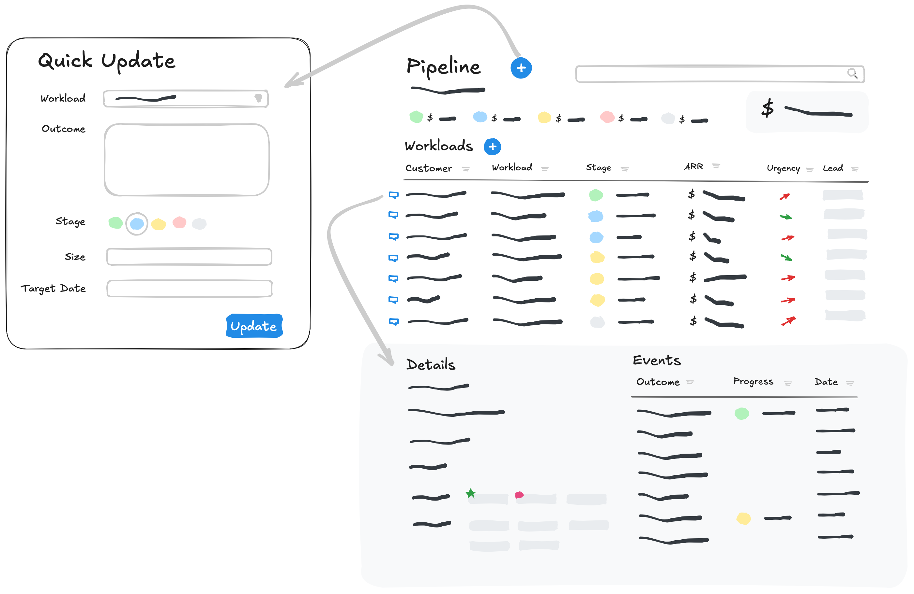

# pipeline



[Source](https://excalidraw.com/#json=ylHeRU4bYLW_nO8O0B3Uh,qEWI7XJz7s3c_x8wJpDIKw)

## Getting Started

```shell
npm install
npm run db
npm run dev
```
## Routes

* `/customers`
	* `./[customer]`: Single customer details, including workloads. Link to `GET` `/events/new?customer=[customer]&workload=[workload]` to create a new event
	* `./new`
		* `GET`: Input form
		* `POST`: Create, redirect to `/customers`
		* `./workloads/new`
			* `GET`: Input form
			* `POST`: Create, redirect to `/customers/[customer]`
			* ~`./[workload]`: Workload details~ *Is this necssary?*
* `/workloads`
	* `./reports`
		* `./bystage`: Report grouped by stage
		* `./needslove`: Aging report
	* `?customer`: Filter by multiple customers (OR)
	* `?stage`: Filter by multiple stages (OR)
	* `?size`
* `/events`
	* `?customer`
	* `?workload`
	* `?when=last+7+days`
	* `./[event]`: Detail
	* `./new`
		* \[`?customer`\]
		* \[`?workload`\]
		* \[`next`\]: Path to return to, e.g. `/customers/[customer]`


## Model

* customers
	* customer 🔑
	* label
	* name
	* *segment*
	* *industry*
	* *region*
* workloads
	* workload 🔑
	* label
	* customer 🔗
* events
	* event 🔑
	* workload 🔗
	* happened_at
	* outcome

## Rebuild Container

```shell
cp .devcontainer/.env.example .devcontainer/.env
```
